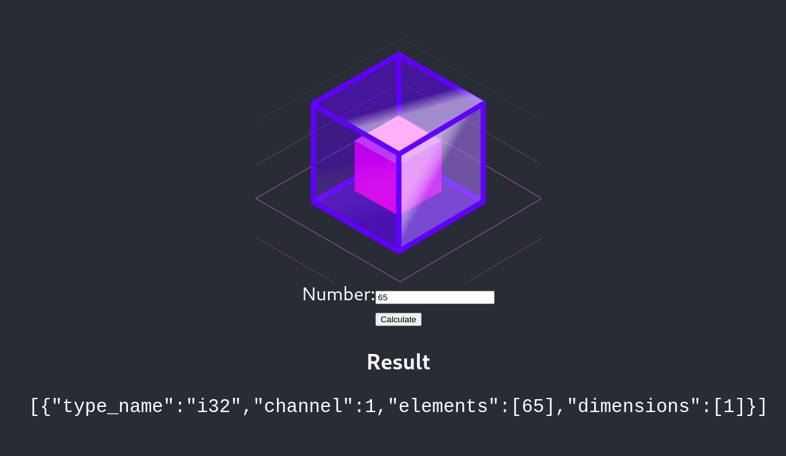
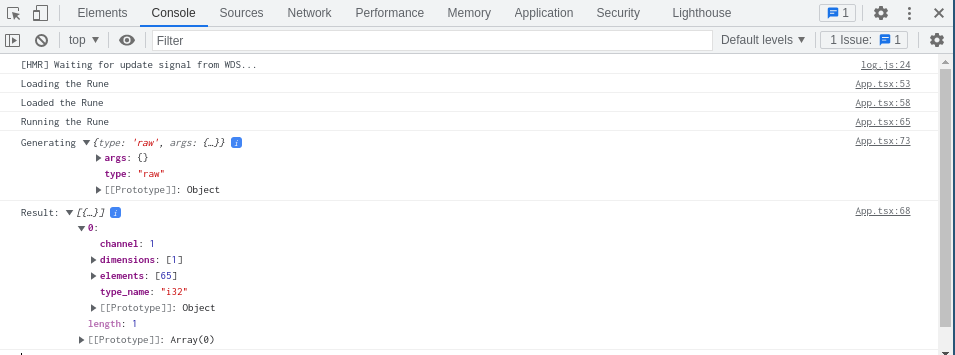

# Lesson 4: Integrating With The Browser

[](https://gitpod.io/#https://github.com/hotg-ai/tutorials/edit/main/lessons/lesson-4/README.md)

In this lesson, we will build a simple React web app that uses the browser
runtime to run a Natural Language Processing Rune.

## Steps

### Setting Up the React App

Before we begin, we will need to create a new React app using
`create-react-app` and the TypeScript template.

```console
$ yarn create react-app lesson-4 --template typescript
$ cd lesson-4
$ tree -I node_modules
.
├── package.json
├── public
│   ├── favicon.ico
│   ├── index.html
│   ├── logo192.png
│   ├── logo512.png
│   ├── manifest.json
│   └── robots.txt
├── README.md
├── src
│   ├── App.css
│   ├── App.test.tsx
│   ├── App.tsx
│   ├── index.css
│   ├── index.tsx
│   ├── logo.svg
│   ├── react-app-env.d.ts
│   ├── reportWebVitals.ts
│   └── setupTests.ts
├── tsconfig.json
└── yarn.lock

2 directories, 19 files
```

If you are following along in GitPod, you might want to run this in a different
folder (e.g. `/tmp`) so you can use the `lesson-4` app as a reference.

Once `yarn create` has finished, we can add Rune's browser runtime as a
dependency.

```console
$ yarn add @hotg-ai/rune
success Saved lockfile.
success Saved 14 new dependencies.
info Direct dependencies
└─ @hotg-ai/rune@0.6.2
info All dependencies
├─ @hotg-ai/rune@0.6.2
├─ @tensorflow/tfjs-backend-webgl@3.11.0
├─ @tensorflow/tfjs-converter@3.11.0
├─ @tensorflow/tfjs-core@3.11.0
├─ @tensorflow/tfjs-data@3.11.0
├─ @tensorflow/tfjs-layers@3.11.0
├─ @tensorflow/tfjs-tflite@0.0.1-alpha.7
├─ @tensorflow/tfjs@3.11.0
├─ @types/long@4.0.1
├─ @types/node-fetch@2.5.12
├─ @types/webgl2@0.0.6
├─ core-js@3.19.1
├─ form-data@3.0.1
└─ long@4.0.0
```

Due to [a bug in `@tensorflow/tfjs-tflite`'s NPM package][tfjs-5532], we need to
do some extra steps if we want to do inference with TensorFlow Lite models.

```console
$ mkdir -p public/static
$ cd public/static
$ ln -s ../../node_modules/@tensorflow/tfjs-tflite/dist ./js
```

You should now be able to run `yarn start` and see the familiar React logo!

### Creating the Rune

You have already spent a couple of lessons writing Runefiles, so we won't be
trying anything fancy with this Rune. All it'll do is take some data from a
`RAW` capability and send it straight to a `SERIAL` output.

```yaml
image: runicos/base
version: 1

pipeline:
  input:
    capability: RAW
    outputs:
    - type: i32
      dimensions: [1]
  output:
    out: SERIAL
    inputs:
    - input
```

We want this Rune to be accessible from the web app so we'll tell `rune build`
to save it to the `public/` folder.

```console
$ rune build Runefile.yml -o public/lesson-4.rune
   Compiling lesson-4 v0.0.0 (~/.cache/runes/lesson-4)
    Finished release [optimized] target(s) in 0.14s
$ ls public
favicon.ico  index.html  lesson-4.rune  logo192.png  logo512.png  manifest.json  robots.txt
                         ^^^^^^^^^^^^^
```

## Creating the UI

Now we've got the project skeleton and a Rune out of the way, let's dive into
some React code!

Our goal is to create a UI with a text box, a "Calculate" button, and an area
to display the Rune's output.



At the very top of the `src/App.tsx` file we'll need some imports and
definitions.

```ts
import { builder, InputDescription, OutputValue, ReadInput, Result } from '@hotg-ai/rune';
import { Tensor, tensor1d } from '@tensorflow/tfjs-core';

type RunFunc = (r: ReadInput) => Result;
const runeURL = "/lesson-4.rune";
```

This app won't need any extra components, so we'll put all the state at the
top of the `App` functional component.

```ts
export default function App() {
  const [runtime, setRuntime] = useState<RunFunc>();
  const [number, setNumber] = useState(65.0);
  const [result, setResult] = useState("");

  ...
}
```

Notice that the `number` has a default value of `65.0`. We'll use this when
checking our work at the very end.

We can use the `useEffect()` to make sure the `lesson-4.rune` is downloaded and
the Rune runtime is initialized when the page is first opened. To keep things
tidy, all of that logic will be put in an `init()` function that we'll define
in a bit.

```ts
export default function App() {
  ...

  // Initialize the runtime on startup
  useEffect(() => init(setRuntime), []);
  ...
}
```

We want to run the Rune whenever the user presses "Calculate", so let's define
a `submit` function which will pass the user's input to the Rune and save
the outputs to the `result`. Again, to keep things clean we'll be defining a
separate `evaluate()` function for running the Rune and reading results.

```ts
export default function App() {
  ...
  const submit = (e: FormEvent<HTMLFormElement>) => {
    e.preventDefault();
    if (!runtime) { return; }

    const result = evaluate(runtime, number);
    setResult(JSON.stringify(result));
  };
  ...
}
```

Keep in mind that we'll be loading the `runtime` on startup so there is a short
window when it won't be available. If this happens, the `submit` handler should
just return silently.

We also need to throw in a `e.preventDefault()` to make sure hitting "Calculate"
or pressing `<enter>` won't cause the page to refresh.

Finally, we have the JSX which defines our UI. For those who have used React
before this won't be anything special, but if you are new to React then you
may want to check out [the official tutorial][react-tutorial].

```ts
export default function App() {
  ...

  return (
    <div className="App">
      <header className="App-header">
        
        <div>
          <form onSubmit={submit}>
            <div>
              <label>
                Number:
                <input type="number" value={number}
                  onChange={e => setNumber(parseInt(e.target.value))} />
              </label>
            </div>
            <input type="submit" value="Calculate" disabled={!runtime} />
          </form>

          <div>
            <h3>Result</h3>
            <pre><code>{result}</code></pre>
          </div>
        </div>
      </header>
    </div>
  );
}
```

Now we've defined our `App` component we can come back to the `init()` function
from before.  The interesting bit is the `builder().build()` call - this uses
`@hotg-ai/rune`'s high level builder API to configure the Rune runtime before it
is loaded.

In our case we aren't changing any of the defaults, but if you want
to you can handle any log statements from inside the Rune by passing a callback
to the `onDebug()` method, or you can register your own model handlers with the
`withModelHandler()` method (e.g. to handle models Rune doesn't support out of
the box).

```ts
function init(setRuntime: React.Dispatch<React.SetStateAction<RunFunc | undefined>>) {
  console.log("Loading the Rune");

  builder()
    .build(runeURL)
    .then(r => {
      console.log("Loaded the Rune");
      setRuntime(() => r);
    })
    .catch(console.error);
}
```

We also need to define the `evaluate()` function from earlier.

```ts
function evaluate(runtime: RunFunc, angle: number): OutputValue[] {
  console.log("Running the Rune");
  const { outputs } = runtime(input => generateInput(input, angle));

  console.log("Result:", outputs);
  return outputs;
}

function generateInput(input: InputDescription, number: number): Tensor {
  console.log("Generating", input);
  return tensor1d([number], "int32");
}
```

The runtime will use our `generateInput()` function if it wants to read from
a capability, using the `InputDescription` parameter to let you know what type
of capability it is (e.g. `RAW`) and any arguments that were specified in the
Runefile.

Normally you would inspect the `InputDescriptor` and generate the requested
data, but because we know this Rune only uses a single capability we can be
lazy and return a 1D `int32` tensor (note: Rune uses `i32` for 32-bit signed
integers, while tf.js prefers to call them `int32`).

If we pull up the browser's developer tools, we can see the messages that were
logged as the runtime was loaded and then run.



## Validating Results

We can actually double-check the output using the `rune` CLI. The binary
representation of the number 65 is an `A` followed by 3 null bytes, so we can
use the `printf` command to generate an `input.bin` file containing exactly
those bytes.

```console
$ printf 'A\0\0\0' > input.bin
$ python3 -c 'print(open("input.bin", "rb").read())'
b'A\x00\x00\x00'
```

From there, it's just a case of running `rune run` like normal and inspecting
the output.

```
$ rune run public/lesson-4.rune --raw input.bin
{"type_name":"i32","channel":1,"elements":[65],"dimensions":[1]}
```

Look at that, they're identical!

[tfjs-5532]: https://github.com/tensorflow/tfjs/issues/5819
[react-tutorial]: https://reactjs.org/docs/getting-started.html
